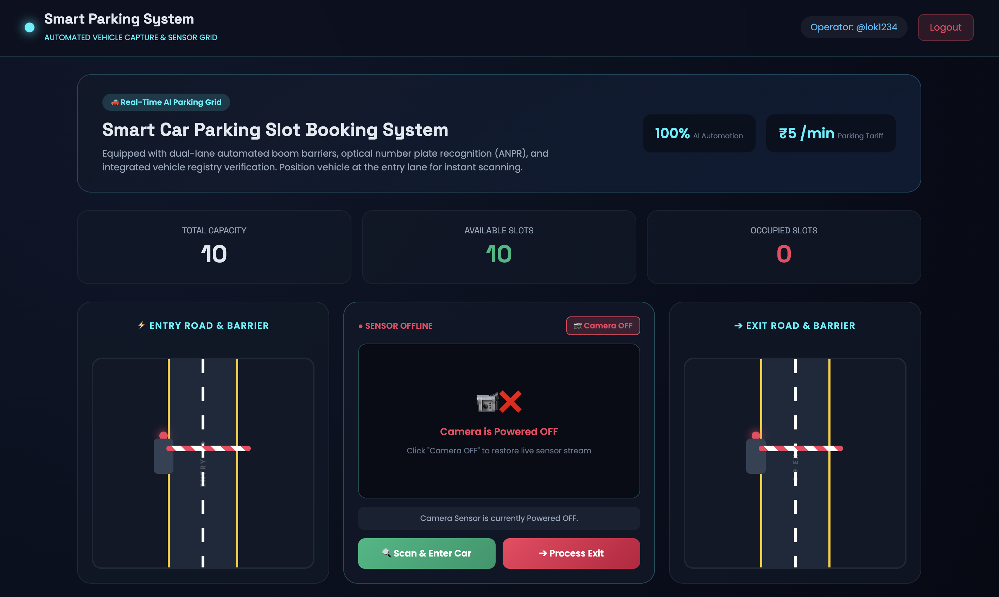
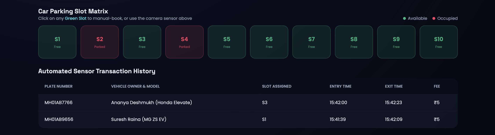

<div align="center">

# 🚗 AI Smart Parking & Automated Vehicle Capture System

<p align="center">
  <b>A Modern Web-Based Intelligent Parking Automation System</b><br>
  Built with HTML5, CSS3, JavaScript & Tesseract.js OCR
</p>

</div>

---

## 📌 About The Project

**AI Smart Parking System** is a modern web-based intelligent parking automation platform designed to simplify and automate vehicle entry, exit, parking management, number plate recognition, vehicle verification, and digital billing.

The system integrates a **real-time Automatic Number Plate Recognition (ANPR) scanner**, **camera-based optical plate detection**, **dual-lane entry and exit barriers**, **RTO vehicle verification**, **interactive parking slots**, and **automated duration-based billing** into a single interactive dashboard.

The project demonstrates how modern web technologies can be used to simulate a smart and automated parking environment without requiring dedicated hardware.

---

## ✨ Key Features

| Feature                       | Description                                                           |
| ----------------------------- | --------------------------------------------------------------------- |
| 🔐 **Authentication System**  | Sign In, Sign Up and Forgot Password functionality                    |
| 🎨 **Cyberpunk UI**           | Modern dark-themed interface with futuristic parking visuals          |
| 📷 **Live Camera Scanner**    | Browser-based camera access for vehicle plate scanning                |
| 🔍 **ANPR Plate Recognition** | Tesseract.js OCR engine for automatic number plate recognition        |
| 🚘 **Vehicle Detection**      | Captures and processes vehicle number plates through the camera       |
| 🚧 **Dual Lane Barriers**     | Separate Entry and Exit lanes with animated road barriers             |
| 🚗 **Car Animation**          | Realistic vehicle entry and exit movement simulation                  |
| 📋 **RTO Vehicle Details**    | Displays vehicle owner, model, fuel type and registration information |
| 🅿️ **Parking Slot Matrix**   | Interactive parking grid with multiple parking slots                  |
| 📊 **Live Parking Status**    | Displays available and occupied parking spaces                        |
| 💰 **Automated Billing**      | Calculates parking charges according to parking duration              |
| 🧾 **Transaction History**    | Maintains records of parking transactions                             |
| 💾 **Local Storage**          | Stores users, sessions, parking data and transactions in the browser  |
| ⚡ **Real-Time Dashboard**     | Provides centralized control and monitoring of parking operations     |

---

# 🖥️ Project Screenshots

## 1️⃣ Front Page — Sign In / Sign Up

<p align="center">
  
</p>

The authentication interface allows users to sign in, create a new account, or reset their password.

---

## 2️⃣ Camera Access Permission

<p align="center">
  
</p>

The system requests browser camera permission before activating the optical ANPR scanner.

---

## 3️⃣ Save Credentials Popup

<p align="center">
  
</p>

Users can choose to save their login credentials in the browser for future sessions.

---

## 4️⃣ Camera Power Controller

<p align="center">
  
</p>

The camera controller allows the user to turn the optical scanner ON or OFF.

---

## 5️⃣ Live Smart Parking Dashboard

<p align="center">
  
</p>

The main dashboard provides a centralized view of parking status, vehicles, lanes, barriers and system operations.

---

## 6️⃣ Interactive Car Parking Slot Matrix

<p align="center">
  
</p>

The parking slot matrix displays available and occupied spaces and allows parking slots to be managed interactively.

---

## 7️⃣ Dual Lane Traffic Hub

<p align="center">
  
</p>

The system simulates two separate traffic lanes:

* 🟢 **Entry Lane** — Vehicle entry and barrier control
* 🔴 **Exit Lane** — Vehicle exit and barrier control

Animated vehicles and servo-style barriers provide a realistic parking automation simulation.

---

## 8️⃣ AI Optical Sensor Scanner

<p align="center">
  
</p>

The optical scanner uses the browser camera to capture the vehicle number plate and process it using OCR technology.

---

## 9️⃣ Transaction & Billing History

<p align="center">
  
</p>

The transaction section maintains parking entry, exit, duration and billing information.

---

# 🛠️ Technologies Used

* **HTML5** — Website structure and semantic elements
* **CSS3** — Responsive design, animations, gradients and modern UI
* **JavaScript (ES6+)** — Application logic and system functionality
* **Tesseract.js** — Optical Character Recognition (OCR)
* **MediaDevices API** — Browser camera access
* **Local Storage** — User accounts, parking data and transaction records
* **Session Storage** — Login and active session management
* **Font Awesome / Icons** — Interface icons and visual elements

---

# 🔍 ANPR & OCR System

The project uses **Tesseract.js** to perform optical character recognition on captured vehicle number plates.

### ANPR Workflow

```text
📷 Camera ON
      ↓
🚘 Vehicle Arrives
      ↓
🔍 Capture Number Plate
      ↓
🧠 Tesseract.js OCR
      ↓
🔤 Extract Plate Number
      ↓
🇮🇳 Validate Vehicle Plate Format
      ↓
📋 RTO Vehicle Verification
      ↓
🅿️ Assign Parking Slot
```

The system is designed to recognize and validate Indian-style vehicle registration numbers.

---

# 🚧 Entry & Exit Barrier System

The parking system includes a simulated dual-lane traffic management system.

```text
                 🚗 VEHICLE
                     ↓
              📷 ANPR SCANNER
                     ↓
              🔍 VERIFICATION
                     ↓
              ┌──────────────┐
              │  ENTRY LANE  │
              └──────┬───────┘
                     ↓
               🚧 BARRIER
                     ↓
                🅿️ PARKING
                     │
                     │
                🚗 VEHICLE
                     ↓
              ┌──────────────┐
              │   EXIT LANE  │
              └──────┬───────┘
                     ↓
               🚧 BARRIER
                     ↓
               💰 BILLING
                     ↓
                  ✅ EXIT
```

---

# 🅿️ Parking Slot Management

The system provides an interactive parking slot matrix for managing vehicle parking.

```text
┌──────┬──────┬──────┬──────┬──────┐
│ P01  │ P02  │ P03  │ P04  │ P05  │
├──────┼──────┼──────┼──────┼──────┤
│ P06  │ P07  │ P08  │ P09  │ P10  │
└──────┴──────┴──────┴──────┴──────┘
```

The system can track:

* 🟢 Available slots
* 🔴 Occupied slots
* 🚗 Assigned vehicles
* ⏱️ Parking duration
* 💰 Parking charges

---

# 💰 Automated Billing System

The system automatically calculates parking charges based on the vehicle's parking duration.

### Example Tariff

```text
Parking Rate = ₹5 / minute

Total Bill = Parking Duration × ₹5
```

### Example

```text
Parking Duration = 30 minutes

Bill = 30 × ₹5
     = ₹150
```

The generated transaction can include:

* Vehicle Number
* Parking Slot
* Entry Time
* Exit Time
* Parking Duration
* Total Amount

---

# 📋 RTO Vehicle Verification

After number plate recognition, the system can display vehicle information through an interactive verification modal.

Example information includes:

```text
Vehicle Number : MP09CA1234
Owner Name     : Registered Owner
Vehicle Model  : Sedan
Fuel Type      : Petrol
Registration   : Active
Timestamp      : Current Date & Time
```

> **Note:** The RTO information displayed by the project is simulated/demo data unless connected to an actual authorized RTO or government vehicle database API.

---

# 🔐 Authentication System

The project includes a complete client-side authentication interface.

### Available Options

```text
🔐 Sign In
   ↓
👤 Existing User
   ↓
🏠 Parking Dashboard
```

or

```text
📝 Sign Up
   ↓
👤 Create Account
   ↓
🔐 Sign In
   ↓
🏠 Parking Dashboard
```

The system also provides a **Forgot Password** flow for account recovery.

---

# 🔑 Default Admin Credentials

You can create a new account or use the default admin credentials provided below.

```text
Username : admin
Password : admin123
```

> ⚠️ **Demo credentials only.** Client-side hard-coded credentials and browser storage are not suitable for production authentication.

---

# 💾 Data Storage

The current web application uses browser-based storage.

### Local Storage

```text
localStorage
   ├── Registered Users
   ├── Parking Slots
   ├── Vehicle Records
   └── Transaction History
```

### Session Storage

```text
sessionStorage
   └── Active Login Session
```

> Since the project uses browser storage, data is stored locally on the user's device/browser and is not automatically synchronized with a central database.

---

# 🔄 How The System Works

```text
🔐 Login / Sign Up
        ↓
🏠 Parking Dashboard
        ↓
📷 Activate Camera
        ↓
🚘 Vehicle Arrives
        ↓
🔍 Scan Number Plate
        ↓
🧠 ANPR / OCR Processing
        ↓
📋 RTO Vehicle Verification
        ↓
🅿️ Assign Parking Slot
        ↓
🚧 Open Entry Barrier
        ↓
🚗 Vehicle Enters
        ↓
⏱️ Track Parking Duration
        ↓
🚗 Vehicle Requests Exit
        ↓
💰 Calculate Parking Bill
        ↓
🚧 Open Exit Barrier
        ↓
🧾 Save Transaction
        ↓
✅ Vehicle Exits
```

---

# 📂 Project Structure

```text
AI-Smart-Parking-System/
│
├── index.html
├── style.css
├── script.js
├── README.md
│
└── Screenshot/
    ├── Front Page.png
    ├── Camera Allow Pop-up.png
    ├── Save Credential.png
    ├── Camera Access.png
    ├── Dashboard.png
    ├── Car Parking Slot.png
    ├── Right and Left Road.png
    ├── Camera Feature.png
    └── Transaction.png
```

---

# 🚀 How To Run

### 1. Clone the Repository

```bash
git clone https://github.com/YOUR-USERNAME/YOUR-REPOSITORY.git
```

### 2. Open the Project

```bash
cd AI-Smart-Parking-System
```

### 3. Run the Website

Open `index.html` in a browser.

For camera/ANPR functionality, it is recommended to run the project through a local server such as **VS Code Live Server** or another HTTPS/localhost development server.

### 4. Login

Use the default credentials:

```text
Username : admin
Password : admin123
```

---

# 🔮 Future Improvements

* 🗄️ **MySQL / MongoDB Database Integration**
* 🔐 **Secure Backend Authentication**
* 🌐 **Real RTO API Integration**
* 🤖 **Advanced AI-Based Number Plate Detection**
* 📷 **Multiple Camera Support**
* 🚧 **Real IoT Servo Motor Integration**
* 💳 **Online Payment Gateway**
* 📱 **Mobile Application**
* ☁️ **Cloud Database & Deployment**
* 📊 **Advanced Parking Analytics**
* 🔔 **Real-Time Notifications**
* 👨‍💼 **Admin & Staff Role Management**
* 🧾 **PDF Invoice Generation**

---

# ⚠️ Project Disclaimer

This project is developed for **educational, demonstration, and simulation purposes**.

The ANPR system, RTO vehicle information, parking barriers, and billing system are software simulations. Actual deployment would require appropriate hardware, secure backend infrastructure, authorized vehicle-data APIs, and compliance with applicable privacy and data-protection regulations.

---

# 👨‍💻 Developer

**Alok Kumar Dangi**

`HTML5` • `CSS3` • `JavaScript` • `Tesseract.js`

<p align="center">
  ⭐ If you like this project, consider giving the repository a star!
</p>

<p align="center">
  <b>🚗 Smart Parking • 🤖 AI Vision • 🚧 Automation • 💰 Digital Billing</b>
</p>
